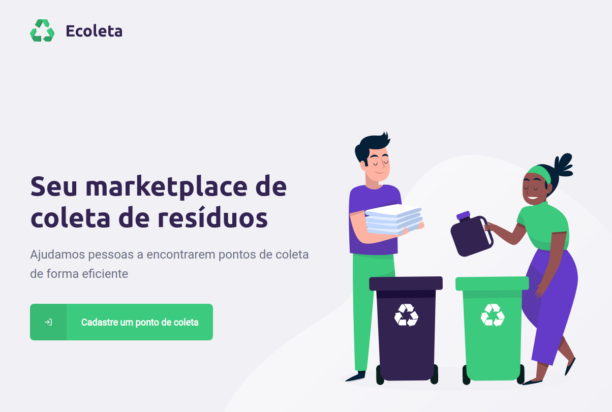

<div align="center">
  
</div>  

#####



<p align="center">An application that helps people identify recycling collection points ♻️</p>

## 🛠️ Technologies

<ul>
  <li><a href="https://www.typescriptlang.org/">TypeScript</a></li>
  <li><a href="https://nodejs.org/en/">Node.js</a></li>
  <li><a href="https://expressjs.com/">Express</a></li>
  <li><a href="https://reactjs.org/">React</a></li>
  <li><a href="https://reactnative.dev/">React Native</a></li>
  <li><a href="https://expo.io/">Expo</a></li>
  <li><a href="https://www.sqlite.org/index.html">SQLite</a></li>
  <li><a href="http://knexjs.org/">Knex.js</a></li>
  <li><a href="https://socket.io/">Socket.io</a></li>
</ul>

## ⚙️ Requirements

<ul>
  <li><a href="https://nodejs.org/en/">Node.js</a></li>
  <li><a href="https://www.npmjs.com/">NPM</a></li>
  <li><a href="https://expo.io/">Expo</a></li>
  <li><a href="https://expo.io/">Expo CLI</a></li>
</ul>

## 🚀 Installation

```bash
$ git clone https://github.com/gabrielsanttana/ecoleta
```

### 🗄️ API

As the web and mobile app use the same API, it's necessary to have an environment variable with the local IP address inside a `.env` file in the backend folder root, in order to make React Native able to call the API locally.

Example:

```
LOCAL_IP_ADDRESS=000.000.00.000
```

```bash
$ cd ecoleta/backend
$ npm install
$ npm run migrate
$ npm run seed
$ npm start
```

The API will start serving on http://localhost:3333

### 💻 Web

```bash
$ cd ecoleta/frontend
$ npm install
$ npm start 
```

The application will pop-up in the browser on http://localhost:3000

### 📱 Mobile

It's also necessary to have an React Native Expo environment setup and the Expo mobile app installed on your smartphone.
It's important that both the smartphone and the computer are connected to the same network and to have the local IP address on the baseURL in the `api.ts` file.

Example:

```
const api = axios.create({
  baseURL: 'http://000.000.00.000:3333',
});
```

With that:

```bash
$ npm install -g expo-cli
$ cd be-the-hero/mobile
$ npm install
$ expo install
$ npm start
```

<p>A new window with the application log will open in the browser</p>
<p>Then, you can simply load the app by scanning the QR code with the Expo mobile app or by using the local URL</p>

## ⚖️ License

[MIT License](https://github.com/gabrielsanttana/ecoleta/blob/master/LICENSE)
